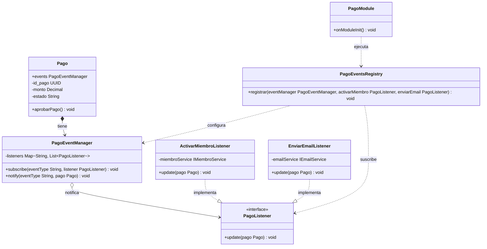

# Blueprint: Patrón Observer Desacoplado para Pagos y Membresías

Guía arquitectónica para implementar el patrón **Observer clásico del GoF** (Gang of Four) en el módulo de pagos, desacoplando completamente las reglas de negocio y de cableado del framework NestJS.

## Arquitectura y Flujo del Patrón

El objetivo es permitir que la clase `Pago` (nuestro **Sujeto/Editor**) notifique cambios de estado (como la aprobación de un pago) sin acoplarse directamente a los servicios que reaccionan a dichos cambios (como activar una membresía o enviar un correo).

Para evitar que los **Observadores** tengan que conocer al publicador (lo que generaría acoplamiento circular), introducimos un **Configurador Puro** (`PagoEventsRegistry`) en la capa de aplicación/dominio, y delegamos la ejecución del arranque a la infraestructura de NestJS (`PagoModule`).

### Diagrama de Componentes (UML Mermaid)



---

## Plan de Implementación (Estructura de Archivos)

### 1. Definición de la Interfaz del Observador (Capa Dominio/Aplicación)
Creamos la interfaz pura en TS sin imports del framework.

```typescript
// apps/api/src/planes/domain/pago-listener.interface.ts
import { Pago } from '../models/pago.entity';

export interface PagoListener {
  update(pago: Pago): void;
}
```

### 2. Implementación del Administrador de Eventos (Capa Dominio/Aplicación)
Maneja la lista de suscriptores y los recorre al notificar.

```typescript
// apps/api/src/planes/domain/pago-event-manager.ts
import { PagoListener } from './pago-listener.interface';
import { Pago } from '../models/pago.entity';

export class PagoEventManager {
  private listeners = new Map<string, PagoListener[]>();

  subscribe(eventType: string, listener: PagoListener): void {
    if (!this.listeners.has(eventType)) {
      this.listeners.set(eventType, []);
    }
    this.listeners.get(eventType)!.push(listener);
  }

  notify(eventType: string, pago: Pago): void {
    const list = this.listeners.get(eventType);
    if (list) {
      list.forEach((listener) => listener.update(pago));
    }
  }
}
```

### 3. Modificación del Sujeto (Entidad de Dominio `Pago`)
El objeto `Pago` almacena una instancia del `PagoEventManager` y se pasa a sí mismo al notificar cambios.

```typescript
// apps/api/src/planes/models/pago.entity.ts
import { PagoEventManager } from '../domain/pago-event-manager';

export class Pago {
  public readonly events = new PagoEventManager();
  // ... atributos de la entidad ...

  public aprobarPago(): void {
    if (this._estado === 'APROBADO') {
      throw new Error('El pago ya está aprobado');
    }
    this._estado = 'APROBADO';
    
    // Disparamos la notificación clásica pasando la instancia actual
    this.events.notify('pagoAprobado', this);
  }
}
```

### 4. Implementación de Observadores Pasivos (Capa de Aplicación)
Los listeners no importan el framework, solo implementan la interfaz `PagoListener` y consumen los servicios de negocio correspondientes.

```typescript
// apps/api/src/planes/application/listeners/activar-miembro.listener.ts
import { PagoListener } from '../../domain/pago-listener.interface';
import { Pago } from '../../models/pago.entity';
import { IMiembroService } from '../../../miembro/services/miembro.service.interface';

export class ActivarMiembroListener implements PagoListener {
  constructor(private miembroService: IMiembroService) {}

  update(pago: Pago): void {
    // Al ser notificado, ejecuta la acción
    this.miembroService.agregarMiembro({
      id_usuario: pago.id_usuario,
      id_comunidad: pago.id_comunidad,
      id_rol_comunidad: 'SUSCRIPTOR',
    });
  }
}
```

### 5. Configurador Puro (Capa de Aplicación)
Se encarga del cableado conectando el gestor con los observadores.

```typescript
// apps/api/src/planes/application/pago-events-registry.ts
import { PagoEventManager } from '../domain/pago-event-manager';
import { PagoListener } from '../domain/pago-listener.interface';

export class PagoEventsRegistry {
  static registrar(
    eventManager: PagoEventManager,
    activarMiembro: PagoListener,
    enviarEmail: PagoListener
  ): void {
    eventManager.subscribe('pagoAprobado', activarMiembro);
    eventManager.subscribe('pagoAprobado', enviarEmail);
  }
}
```

### 6. Punto de Entrada e Inyección (Capa de Infraestructura - NestJS)
El módulo inyecta las instancias reales y ejecuta el configurador puro al arrancar.

```typescript
// apps/api/src/planes/planes.module.ts
import { Module, OnModuleInit } from '@nestjs/common';
import { PagoEventManager } from './domain/pago-event-manager';
import { ActivarMiembroListener } from './application/listeners/activar-miembro.listener';
import { EnviarEmailListener } from './application/listeners/enviar-email.listener';
import { PagoEventsRegistry } from './application/pago-events-registry';
import { IMiembroService } from '../miembro/services/miembro.service.interface';
import { IEmailService } from '../email/email.service.interface';

@Module({
  providers: [
    PagoEventManager,
    {
      provide: ActivarMiembroListener,
      useFactory: (miembroService: IMiembroService) => new ActivarMiembroListener(miembroService),
      inject: [IMiembroService],
    },
    {
      provide: EnviarEmailListener,
      useFactory: (emailService: IEmailService) => new EnviarEmailListener(emailService),
      inject: [IEmailService],
    },
    // ... otros providers ...
  ],
})
export class PlanesModule implements OnModuleInit {
  constructor(
    private eventManager: PagoEventManager,
    private activarMiembro: ActivarMiembroListener,
    private enviarEmail: EnviarEmailListener
  ) {}

  onModuleInit() {
    // El módulo de NestJS actúa como infraestructura y ejecuta la configuración
    PagoEventsRegistry.registrar(
      this.eventManager,
      this.activarMiembro,
      this.enviarEmail
    );
  }
}
```

---

## Plan de Verificación y Testing

Al desacoplar el cableado de NestJS, podemos hacer pruebas unitarias rápidas e independientes:

```typescript
// test/planes/pago-events-registry.spec.ts
import { PagoEventsRegistry } from '../../apps/api/src/planes/application/pago-events-registry';
import { PagoEventManager } from '../../apps/api/src/planes/domain/pago-event-manager';

describe('PagoEventsRegistry', () => {
  it('debe registrar correctamente los listeners al evento pagoAprobado', () => {
    const eventManager = new PagoEventManager();
    const mockActivar = { update: jest.fn() };
    const mockEmail = { update: jest.fn() };

    PagoEventsRegistry.registrar(eventManager, mockActivar, mockEmail);

    // Si disparamos una notificación de prueba en el manager, ambos mocks deben ser llamados
    eventManager.notify('pagoAprobado', {} as any);

    expect(mockActivar.update).toHaveBeenCalled();
    expect(mockEmail.update).toHaveBeenCalled();
  });
});
```
